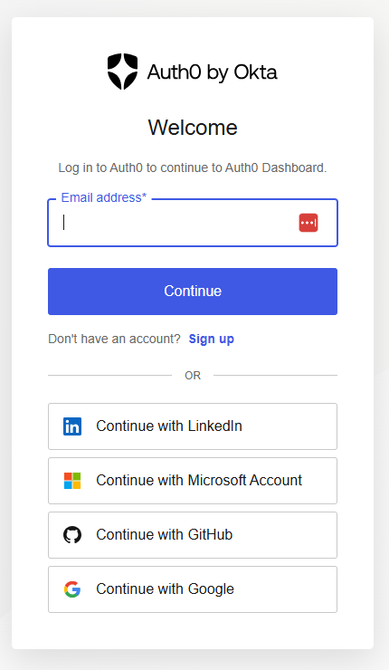
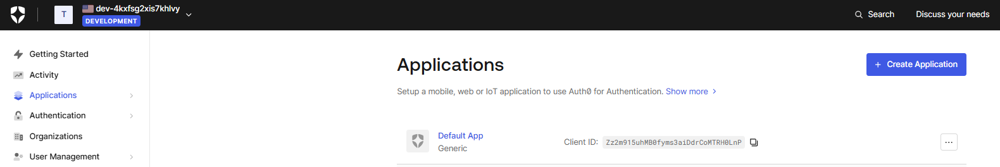
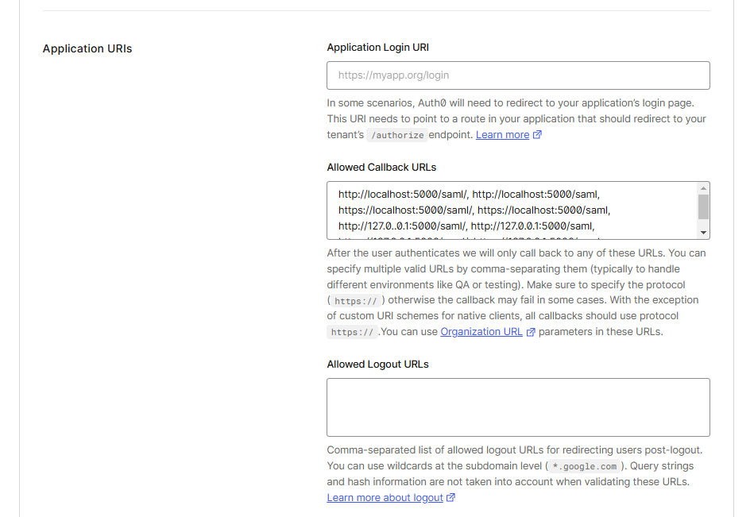
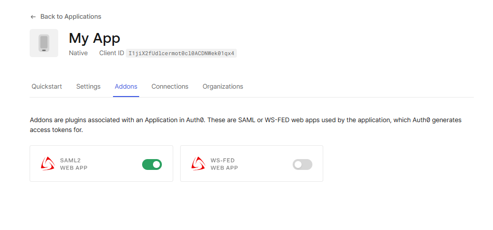
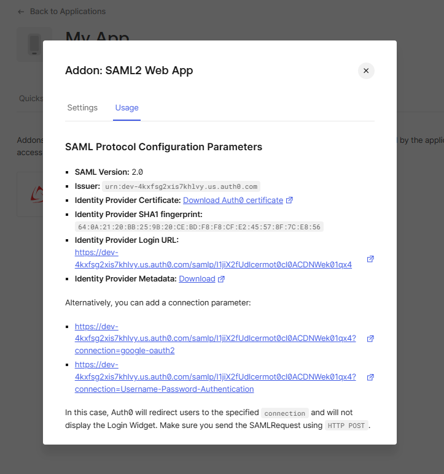
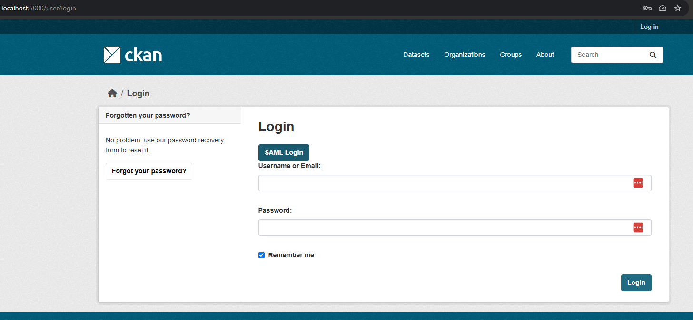
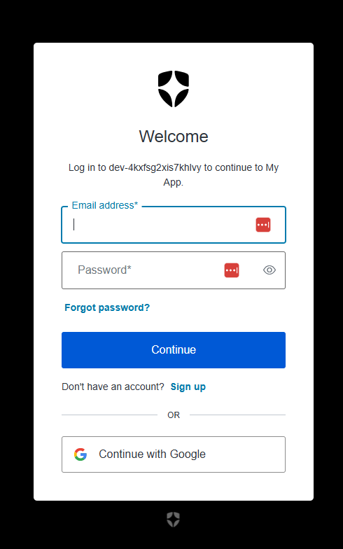

# Usage

## Basic usage

This is the example of setting up of the extension against 
[Auth0](https://auth0.com/) authentication and authorization platform.

1. Register and [log in](https://auth0.com/api/auth/login?redirectTo=dashboard) to Auth0

    

2. Go to the Applications section
    

3. Create a new app and switch to the Settings tab to set necessary configs
    
    

4. Switch to the Addons tab and enable SAML2 WEB APP
    

5. Get all necessary IdP configs
    

    by downloading Identity Provider Metadata

    ----------------------------------------------------------------------------
        <EntityDescriptor entityID="urn:dev-4kxfsg2.us.auth0.com" xmlns="urn:oasis:names:tc:SAML:2.0:metadata">
            <IDPSSODescriptor protocolSupportEnumeration="urn:oasis:names:tc:SAML:2.0:protocol">
                <KeyDescriptor use="signing">
                    <KeyInfo xmlns="http://www.w3.org/2000/09/xmldsig#">
                        <X509Data>
                        <X509Certificate>4VDqTySXJSeAdNI4HEGux</X509Certificate>
                        </X509Data>
                    </KeyInfo>
                </KeyDescriptor>
                <SingleLogoutService Binding="urn:oasis:names:tc:SAML:2.0:bindings:HTTP-Redirect" Location="https://dev-4kxfsg2.us.auth0.com/samlp/I1jiX2fUdlcermot0cl0ACDNWek01qx4/logout"/>
                <SingleLogoutService Binding="urn:oasis:names:tc:SAML:2.0:bindings:HTTP-POST" Location="https://dev-4kxfsg2.us.auth0.com/samlp/I1jiX2fUdlcermot0cl0ACDNWek01qx4/logout"/>
                <NameIDFormat>urn:oasis:names:tc:SAML:1.1:nameid-format:emailAddress</NameIDFormat>
                <NameIDFormat>urn:oasis:names:tc:SAML:2.0:nameid-format:persistent</NameIDFormat>
                <NameIDFormat>urn:oasis:names:tc:SAML:2.0:nameid-format:transient</NameIDFormat>
                <SingleSignOnService Binding="urn:oasis:names:tc:SAML:2.0:bindings:HTTP-Redirect" Location="https://dev-4kxfsg2.us.auth0.com/samlp/I1jiX2fUdlcermot0cl0ACDNWek01qx4"/>
                <SingleSignOnService Binding="urn:oasis:names:tc:SAML:2.0:bindings:HTTP-POST" Location="https://dev-4kxfsg2.us.auth0.com/samlp/I1jiX2fUdlcermot0cl0ACDNWek01qx4"/>
                <Attribute Name="http://schemas.xmlsoap.org/ws/2005/05/identity/claims/emailaddress" NameFormat="urn:oasis:names:tc:SAML:2.0:attrname-format:uri" FriendlyName="E-Mail Address" xmlns="urn:oasis:names:tc:SAML:2.0:assertion"/>
                <Attribute Name="http://schemas.xmlsoap.org/ws/2005/05/identity/claims/givenname" NameFormat="urn:oasis:names:tc:SAML:2.0:attrname-format:uri" FriendlyName="Given Name" xmlns="urn:oasis:names:tc:SAML:2.0:assertion"/>
                <Attribute Name="http://schemas.xmlsoap.org/ws/2005/05/identity/claims/name" NameFormat="urn:oasis:names:tc:SAML:2.0:attrname-format:uri" FriendlyName="Name" xmlns="urn:oasis:names:tc:SAML:2.0:assertion"/>
                <Attribute Name="http://schemas.xmlsoap.org/ws/2005/05/identity/claims/surname" NameFormat="urn:oasis:names:tc:SAML:2.0:attrname-format:uri" FriendlyName="Surname" xmlns="urn:oasis:names:tc:SAML:2.0:assertion"/>
                <Attribute Name="http://schemas.xmlsoap.org/ws/2005/05/identity/claims/nameidentifier" NameFormat="urn:oasis:names:tc:SAML:2.0:attrname-format:uri" FriendlyName="Name ID" xmlns="urn:oasis:names:tc:SAML:2.0:assertion"/>
            </IDPSSODescriptor>
        </EntityDescriptor>
    ----------------------------------------------------------------------------

6. Configure main settings file ``settings.json``. 
    It may be done manually inside the file or through the CKAN configuration 
    file using variables with prefix ``ckanext.saml.settings.substitution``.
    The example of the settings.json file is below:

    ----------------------------------------------------------------------------
        {
            "strict": true,
            "debug": true,

            "sp": {
                "entityId": "<SP_ENTITY_ID>",
                "assertionConsumerService": {
                    "url": "<SITE_URL>/sso/post",
                    "binding": "urn:oasis:names:tc:SAML:2.0:bindings:HTTP-POST"
                },
                "singleLogoutService": {
                    "url": "<SITE_URL>/slo/post",
                    "binding": "urn:oasis:names:tc:SAML:2.0:bindings:HTTP-Redirect"
                },
                "NameIDFormat": "urn:oasis:names:tc:SAML:2.0:nameid-format:transient",
                "x509cert": "<SP_CERT>",
                "privateKey": "<SP_PRIVATE_CERT>"
            },

            "idp": {
                "entityId": "<IDP_ENTITY_ID>",
                "singleSignOnService": {
                    "url": "<SSO_URL>",
                    "binding": "urn:oasis:names:tc:SAML:2.0:bindings:HTTP-Redirect"
                },
                "singleLogoutService": {
                    "url": "<SLO_URL>",
                    "binding": "urn:oasis:names:tc:SAML:2.0:bindings:HTTP-Redirect"
                },
                "x509cert": "<CERT>"
            },

            "security": {
                "requestedAuthnContext": false,
                "nameIdEncrypted": false,
                "authnRequestsSigned": true,
                "logoutRequestSigned": false,
                "logoutResponseSigned": false,
                "signMetadata": false,
                "wantMessagesSigned": false,
                "wantAssertionsSigned": false,
                "wantNameId" : true,
                "wantNameIdEncrypted": false,
                "wantAssertionsEncrypted": false,
                "signatureAlgorithm": "http://www.w3.org/2001/04/xmldsig-more#rsa-sha256",
                "digestAlgorithm": "http://www.w3.org/2001/04/xmlenc#sha256"
            },
            "contactPerson": {
                "technical": {
                    "givenName": "technical_name",
                    "emailAddress": "technical@example.com"
                },
                "support": {
                    "givenName": "support_name",
                    "emailAddress": "support@example.com"
                }
            },
            "organization": {
                "en-US": {
                    "name": "sp_test",
                    "displayname": "SP test",
                    "url": "http://sp.example.com"
                }
            }
        }
    ----------------------------------------------------------------------------

7. SAML settings in CKAN config file (e.g. ckan.ini or production.ini)

    ----------------------------------------------------------------------------
        ## ckanext-saml
        ckanext.saml.unconditional_login = true
        ckan.saml_custom_base_path = %(here)s/saml
        ckanext.saml.metadata.base_path = %(here)s/saml
        ckan.saml_use_https = true
        ckanext.saml.settings.dynamic = true
        ckanext.saml.session.ttl = 2_592_000
        ckanext.saml.reactivate_deleted_account = true
        ckanext.saml.settings.substitution.SITE_URL = %(ckan.site_url)s
        ckanext.saml.settings.substitution.SP_ENTITY_ID = %(ckan.site_url)s
        ckanext.saml.settings.substitution.IDP_ENTITY_ID = urn:dev-4kxfsg2.us.auth0.com
        ckanext.saml.settings.substitution.SSO_URL = https://dev-4kxfsg2.us.auth0.com/samlp/I1jiX2fUdlcermot
        ckanext.saml.settings.substitution.SLO_URL = https://dev-4kxfsg2.us.auth0.com/samlp/I1jiX2fUdlcermot
        ckanext.saml.settings.substitution.CERT = MIIDHTCCAgWgAwIBAgIJMpgtCcFJo8dsdff...VDqTySXJSeAdNI4HEGux
        ckanext.saml.settings.substitution.SP_PRIVATE_CERT = MIIEvgIBADANBgkqhkiG9w0B...kYLQbPdaq+Bv7keWLz

8. Log in to CKAN using SAML
    
    

9.  Finally you are there with secure access.